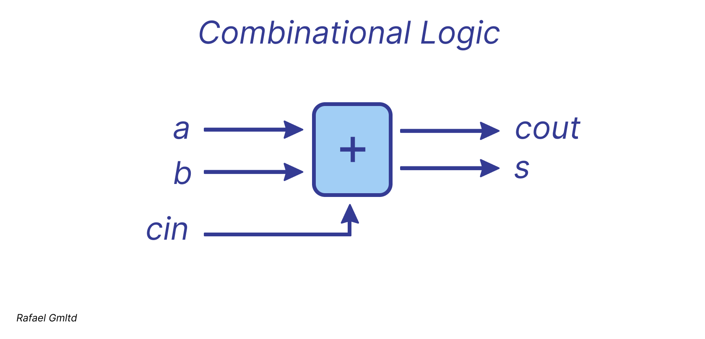

# *Combinational Logic*

Combinational logic describes the behavior of circuits in which output signals are determined solely by the current values of the input signals, 
without regard to any prior states. Such circuits do not incorporate memory elements, operate independently of clock signals, and respond 
immediately: once an input is applied, the corresponding output is produced without waiting for a clock edge.

