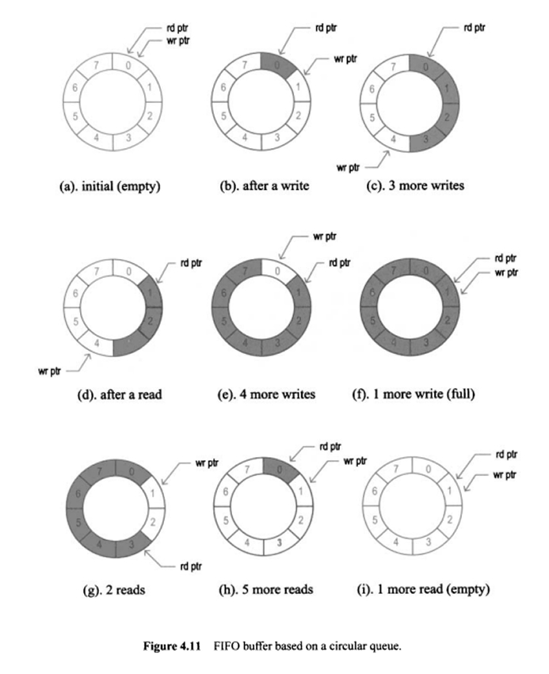

# FIFO

## Types of Data Transfer

In digital systems, there are several methods for data transfer, depending on how the transmitter and receiver coordinate their operation:

### Synchronous Data Transfer
In synchronous transfer, both the transmitter and receiver operate using a shared clock signal. Data is transferred strictly on clock edges (rising or falling). This method is fast but requires precise clock synchronization between both sides.

### Receiver-Driven Handshake (Receiver Ready First)
In this method, the receiver first signals that it is ready to accept data by asserting a ready signal. The transmitter waits for this signal before sending data. This approach helps avoid receiver overflows.

### Transmitter-Driven Handshake (Transmitter Ready First)
Here, the transmitter first indicates that it has data to send by asserting a valid signal. The receiver monitors this signal and takes the data when it is ready. This gives the receiver the ability to control when it accepts data.

### Two-Way Handshake (valid + ready)
This is the most reliable method, especially in asynchronous or clock-crossing systems. The transmitter asserts valid when the data is ready, and the receiver asserts ready when it can accept data. Data is only transferred when both signals are high. This mechanism ensures safe and correct data transfer, even between modules running at different clock rates.

## Buffered Transmission with Stalled Receiver and the Role of FIF
If the receiver temporarily stalls for some reason, the transmitter can continue sending data by storing it in a buffer, assuming the receiver will eventually resume and retrieve the accumulated data. This approach is particularly useful when the transmitter and receiver operate at slightly different speeds.

You can think of the buffer like a water tank: the transmitter slowly fills it, and the receiver later scoops the data out quickly. However, this setup brings up several important challenges:

- What happens if the buffer overflows?

- How do we prevent data loss?

- How do we avoid the receiver reading from an empty buffer?

These challenges are solved using a FIFO (First-In, First-Out) structure. FIFO manages reads and writes automatically, indicating when it is full or empty, ensuring safe and reliable data transfer even between asynchronous or loosely synchronized components.

## Classic FIFO and Its Interface

A classic FIFO (First-In, First-Out) buffer provides a simple external interface:

#### push — signal to write data into the buffer;

#### pop — signal to read data from the buffer;

#### FULL — flag indicating the buffer is full;

#### EMPTY — flag indicating the buffer is empty.

It is crucial to use these signals correctly.
You must not assert put when FULL is high, as this may result in data loss.
Likewise, you must not assert get when EMPTY is high, as this could result in reading invalid or garbage data.

Proper control of access based on FIFO status flags ensures safe and reliable data exchange.
The core of a FIFO is made up of memory cells — typically registers or flip-flops that store the data.
Access to these cells can be either parallel or serial, depending on the required speed and the structure of the interface.
However, regardless of the data access method, it’s the control logic that defines how the FIFO operates.
It decides when writing (put) and reading (get) is allowed, how to update read and write pointers, and how to correctly set the FULL and EMPTY flags.

Most data buses and communication protocols are built around this kind of interface.

It’s important to distinguish a FIFO from a shift register:
- A shift register is a chain of flip-flops that moves data toward the output every clock cycle,
- A FIFO is built on memory, not flip-flops, and it implements a “first-in, first-out” logic queue
  First Word Fall Through (FWFT) is a FIFO behavior where the first word written into the FIFO 
  immediately appears at the output without requiring a read enable.

It allows decoupling of the transmitter and receiver — they can operate independently from each other. Each side can perform its own tasks, send or process data without having to wait for the other.
Data is written to the buffer whenever it’s ready, and the other side reads it when needed. This makes them temporally independent from each other.

## Circular (ring) buffer

### Generation of FULL and EMPTY flags based on the FIFO occupancy counter.

Example for a circular (ring) buffer:
Imagine a PC with high processing speed.
To make full use of that speed, it makes sense to process data in bulk, like loading sand in sacks instead of carrying it grain by grain.

Let’s say we have an ADC (Analog-to-Digital Converter) that samples data at a steady rate and writes it into a buffer.
Once the ADC has written a full packet, the PC can quickly read and process it.

The key concept here is the write and read pointers, which move in a ring — like chasing each other counterclockwise.

- The write pointer points to the next free cell after the last occupied one.

- The read pointer points to the currently occupied cell from which we need to read data.

Here arises a problem: since the system is synchronous and everything happens on clock edges, the transmitter may detect the FULL signal too late — only on the next clock cycle, after writing data into an already full buffer. This causes the last written data to be lost.
For example, the buffer is not yet full, but a write occurs, and this makes it full. However, the transmitter only sees the updated FULL signal on the next clock cycle. If the wr_en (write enable) signal remains active at that moment, a violation occurs: data is written into an already full buffer.
This means that the FULL and EMPTY signals should be generated in advance, taking into account the intent to write or read on the current clock.
If wr_en is active, we assume one more write will happen, and thus the buffer becomes full. Likewise, if rd_en is active, we assume a read will happen and the buffer becomes empty.
BUT! This approach will not work correctly if wr_en and rd_en are generated using combinational logic. In such cases, combinational loops may occur, making the design unsynthesizable and non-functional.

## Credit Counter Concept

In the transmitter, a special counter is introduced — the credit counter, which keeps track of the number of free slots in the receiver's buffer. In this approach, the decision to transmit data is made not based on the FULL signal, but rather based on the current value of the credit counter.

When the receiver reads data and thus frees up space in its buffer, the credit counter is incremented. When the transmitter sends data (occupying buffer space), the credit counter is decremented.

This leads to a simple rule: data can be transmitted as long as the credit counter is not zero.
The buffer regulates the counter’s state:
- if space is occupied → the counter decreases
- if space is freed → the counter increases

## Generation of full and empty flags based on the read and write pointers of the FIFO.

The FIFO depth is a power of two: 1, 2, 4, 8, ...
Input data is written to the address pointed to by the write pointer and read from the address pointed to by the read pointer.

Mechanism for Generating full and empty Flags Based on Read and Write Pointers in FIFO with Power-of-Two Depth
In a circular FIFO buffer, the full and empty flags are typically generated by comparing the read pointer and the write pointer. At first glance, both conditions—empty and overflow—may seem to be characterized by the same situation: the read and write pointers are equal. However, this equality alone cannot distinguish between an empty buffer and a full one. To resolve this ambiguity, an additional most significant bit (MSB) is added to each pointer.

Example
Assume a FIFO buffer with a depth of 4(Important). This requires 2 bits to address all locations. By adding one MSB, we extend the pointer width to 3 bits: MSB + address.

Initial state:

Write pointer: 0_00
Read pointer: 0_00

→ This is interpreted as an empty buffer.

Now, suppose three write operations occur without any reads:

Write 1 → 0_01
Write 2 → 0_10
Write 3 → 0_11

When the fourth write is performed, the pointer wraps around to the beginning, but the MSB flips:

Write 4 → 1_00

Meanwhile, the read pointer remains at 0_00. At this point, the lower address bits are equal (00), but the MSB is different. This pattern indicates that the buffer is full.

Hence:

The buffer is empty when all bits, including the MSB, of the read and write pointers are equal.
The buffer is full when the lower address bits are equal, but the MSBs differ (i.e., the write pointer's MSB is the inverse of the read pointer's MSB).

Example of Simultaneous Read and Write
If reading and writing occur simultaneously, the pointers move together. For instance:

Write reaches position 0_11, read is at 0_10

On the next clock cycle, both move to 1_00

Since both the MSB and the lower bits now match, this condition is again interpreted as an empty buffer.

## Slow Clock Generation Explanation

If the entire system operates at a frequency of **100 MHz**, then, for example, a seven-segment display simply cannot process signals at such a high rate — the image would flicker or not appear at all.  
Therefore, we introduce a **slow clock** — a signal that toggles much more slowly (e.g., **100 Hz** or even **1 Hz**).

In previous projects, we used an approach based on a **strobe signal** — a single pulse triggered when a counter reaches a certain value.  
This method is convenient for **one-shot triggers**, but it doesn't provide a stable clock frequency.

---

### Stage 1: `counter`

This is a basic counter that increments by `+1` on each rising edge of the system clock `clk`.

- The input `enable` is always set to `1`, so the counter runs continuously.
- The counter width is **26 bits**, which means it counts from `0` to `2^26 - 1` to complete one full cycle.
- This requires exactly `2^26` clock cycles of the global `clk`.

The output signal `slow_clk_raw` is derived from the **most significant bit** of the counter:

- This bit toggles **once every `2^25` clock cycles**, i.e., its frequency is **2× slower** than the full counter frequency.

### Why We Use `BUFG` for Slow Clock

The **slow clock** that we generate is just a regular signal (`slow_clk_raw`).  
However, to use it as a **clock source** in other modules (such as for synchronizing a FIFO, display refresh, etc.), this signal must be connected to the **global clock network**.

That's where the `BUFG` primitive comes into play:

- `BUFG` is a special buffer provided by the FPGA fabric.
- It connects the input signal to the **global clock routing**, allowing the signal to be used safely as a real clock.

Using `slow_clk_raw` directly as a clock without a `BUFG` is **not recommended**:
- It may cause **glitches**, since it is not guaranteed to be glitch-free or properly routed.
- It can lead to **timing issues** and **synchronization failures**.

