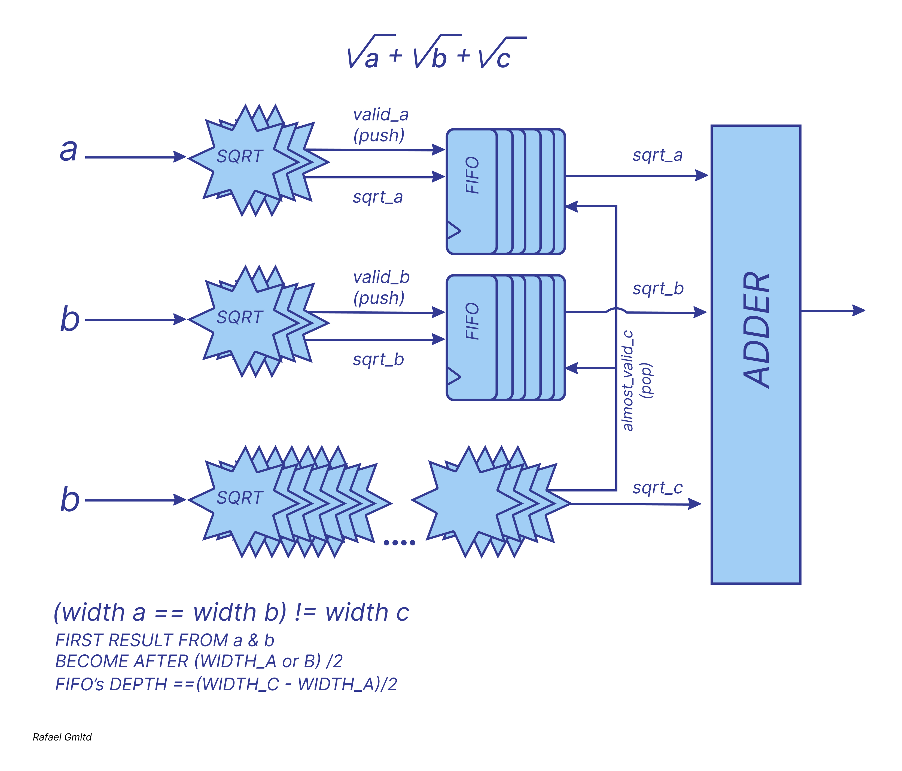
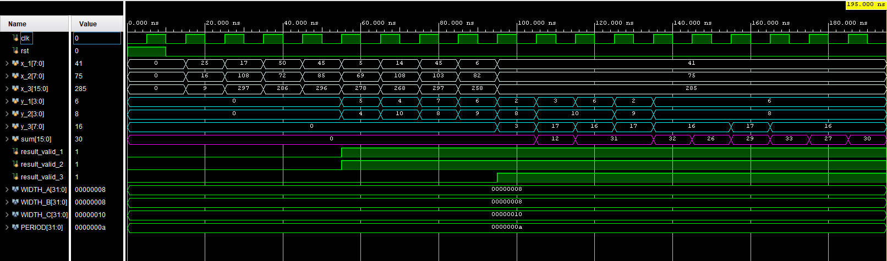

# *Square Root Summation System*

### Description

This system receives three input numbers and computes their square roots using an iterative hardware algorithm. The first two inputs have equal bit-widths, while the third one is twice as wide. As a result, the third square root takes approximately twice as long to compute.
To ensure synchronized output for all three values, the system uses FIFO buffering and a control unit that aligns the results before summation.

### System Behavior

- All three input values are passed to instances of the `sqrt_unit` module.
- Square root computation is **step-based** and requires **N/2 clock cycles**, where `N` is the input bit-width.
- Two numbers complete faster; the third, being wider, takes longer.
- To enable simultaneous summation:
  - The first two results are stored in FIFO buffers.
  - Once the third result is ready, all three are read together and summed.

### Architecture

`top_sqrt`
 Iterative square root calculation unit using a step-by-step algorithm (e.g., non-restoring or digit-by-digit).

###  FIFO Buffers
 Temporarily store early results until the third is ready; prevents data loss and ensures output alignment.
`top_adder`
 Adds three square root results once all are available.

###  Controller / FSM
 Manages:
- Input/output handshake
- FIFO write/read logic
- Detection of result readiness
- Synchronization of data flow into the summation stage

### Result

This system correctly handles input values with **asynchronous computation latencies**, ensuring:
- No result is lost
- Summation occurs **only when all three square roots are ready**
- Accurate and deterministic output

