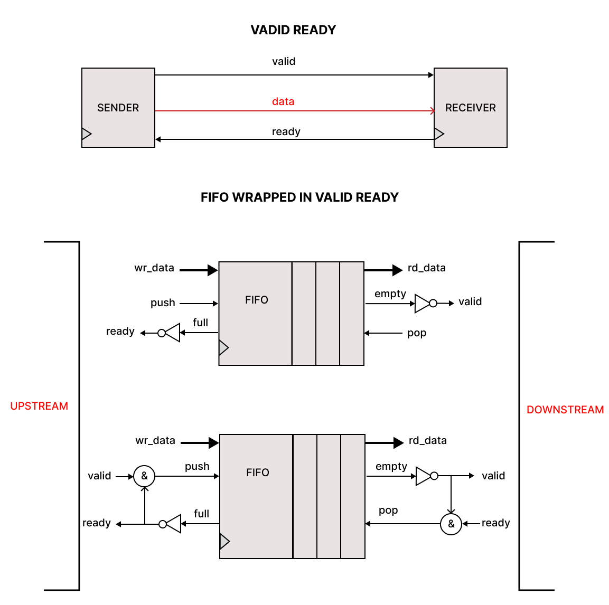

# Valid/Ready Protocol

The **Valid/Ready protocol** is one of the most widely used interface protocols in digital logic design, especially for data transfers between modules in different clock domains or within System-on-Chip (SoC) architectures.

### Signal Descriptions

| Signal  | Direction         | Description                                   |
|---------|-------------------|-----------------------------------------------|
| `valid` | Transmitter → Receiver | Indicates that the data is valid and available. |
| `ready` | Receiver → Transmitter | Indicates that the receiver is ready to accept data. |

1. **Data is transferred only when both `valid` and `ready` are high**
   - `valid` means the transmitter has prepared the data.
   - `ready` means the receiver is ready to accept it.
   - Only when both signals are asserted, the data is actually transferred.

2. **`valid` is controlled by the sender**
   - The transmitter decides when the data is ready.
   - It holds `valid = 1` until the data is accepted (`ready = 1`).

3. **`ready` is controlled by the receiver**
   - The receiver decides when it's ready to accept data.
   - It can hold `ready = 0` to pause data intake.

4. **If `ready = 0`, the data is "frozen"**
   - The transmitter must not change the data on the bus while `ready = 0`.
   - It must keep the same data until `ready` goes high.

# Why It's Better to Keep `ready` High by Default

The `valid/ready` handshake protocol is designed to ensure smooth and efficient data transfer between modules. Here's why keeping `ready = 1` by default is a best practice for receivers.

### How the Protocol Works

- **Transmitter** asserts `valid = 1` when data is available.
- **Receiver** asserts `ready = 1` when it's ready to accept data.
- A **transaction occurs** on the **next clock cycle** when both `valid` and `ready` are high.

### Benefits of Keeping `ready = 1` Always

- The receiver **does not block** the transmitter.
- As soon as `valid = 1`, the data is accepted **on the next clock cycle**.
- This ensures **maximum throughput** — one transfer per clock cycle is possible.
- Known as **zero-latency ready** or **always-ready interface** — ideal for performance.

### What Happens If `ready` Is Not Always High?

- The transmitter has to **wait** for the receiver to assert `ready`.
- This introduces **extra cycles of latency**.
- Overall data flow becomes **slower and less efficient**.

### Recommended Strategy

- Keep `ready = 1` **by default**.
- Only set `ready = 0` when:
  - The receiver is **busy or full**.
  - You need to **throttle** incoming data.

# FIFO with Valid/Ready Protocol

In this setup, we wrap the FIFO with the **Valid/Ready** protocol. Here's how it works:

### Components:

- **UPSTREAM**: This is where the data is coming from (e.g., a sender or a producer).
- **FIFO**: This is the buffer that temporarily holds the data.
- **DOWNSTREAM**: This is where the data will go (e.g., a receiver or a consumer).

### How It Works:

- **Ready on UPSTREAM**: This signal indicates that the upstream module is ready to **receive data** and is **not full**. So, when `ready = 1`, it means the upstream module is open to receiving more data.
  
- **Valid on DOWNSTREAM**: This signal indicates that the downstream module has **valid data** and is **not empty**. When `valid = 1`, the downstream module is ready to send data.

### FIFO as an Intermediate Buffer

- FIFO acts as an **intermediate link** between the upstream and downstream modules. Both modules communicate via the **Valid/Ready** handshake.
- On the **UPSTREAM** side, the `ready` signal indicates that the FIFO can accept more data (not full).
- On the **DOWNSTREAM** side, the `valid` signal indicates that the FIFO contains valid data to send (not empty).
  
Thus, the FIFO facilitates data transfer by buffering and regulating the flow of data between the upstream and downstream components, ensuring that both can **synchronize** and **avoid overflow/underflow**.

# Generating `push` and `pop` Signals Based on the Valid/Ready Protocol

Now, based on the logic of how FIFO works when wrapped with the Valid/Ready protocol, let's define how the control signals **push** and **pop** are formed.

### What Are `push` and `pop`?

- **Push** — this signal indicates a **write operation to the FIFO**. We "push" data into the FIFO when it comes from the sender (upstream).
- **Pop** — this signal indicates a **read operation from the FIFO**. We "pop" data from the FIFO when the receiver (downstream) is ready to accept it.

### When Can We `push`?

We can write to the FIFO (issue a `push`) only when two conditions are met:

1. **Upstream asserts `valid = 1`** — this means the sender has valid data available.
2. **The FIFO is not full (`!full`)** — there is space in the FIFO to accept new data.

**Push Pop condition:**

push = upstream_valid && !fifo_full;

pop = downstream_ready && !fifo_empty;

