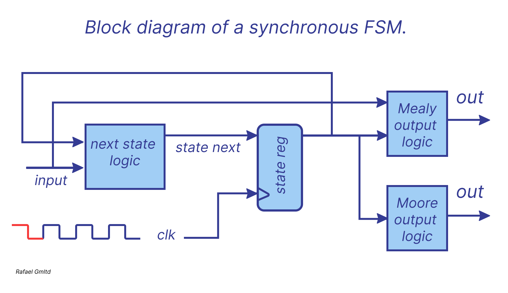
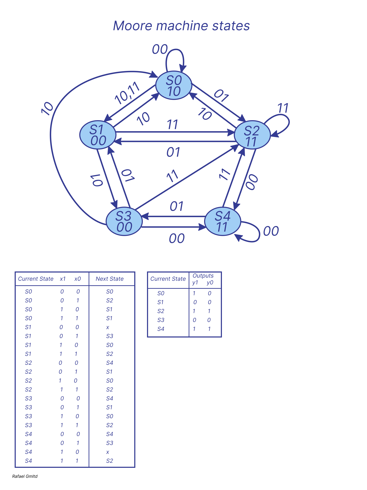
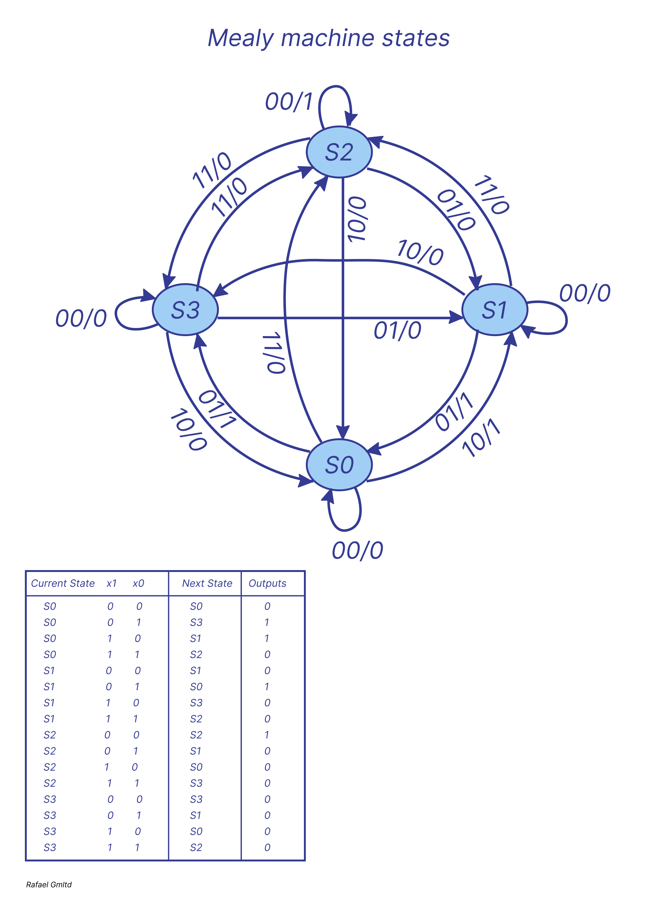

# *A finite state machine*

A finite state machine (FSM) is a model of a system that transitions between a limited number of internal states. 
State transitions depend on both the current state and external input signals. Unlike regular sequential circuits, 
state changes in an FSM do not follow a simple, repetitive pattern. The transition logic in an FSM is usually designed 
from scratch and is sometimes referred to as "random" logic. This differs from the next-state logic in regular sequential circuits, 
which is primarily based on "structured" components such as incrementers and shift registers.

### Mealy and Moore outputs

The structure of a finite state machine (FSM) is similar to that of a regular sequential circuit. It consists of a state register, 
next-state logic, and output logic.
If the output depends only on the current state, the FSM is called a Moore machine. If the output is determined by both 
the current state and external input, it is known as a Mealy machine.

### Moore machine

It is a Moore machine because the outputs depend on the states but do not
depend on the transition (edge).
Inputs are associated to the state transitions, above the arcs which represent the transitions.
There are 2 inputs that we will name as x1 and x0.
There are 2 outputs that we will name as y1 and y0.
The state-transition or next-state-table tells us which will be the next state of the graph depending 
on the current state and the input:

### Mealy machine

In this case the graph represents a Mealy machine because its outputs are associated with the state transitions (edges). 
The nomenclature 00/0 is quite usual and means that, when the inputs are 00 (the two bits before the “/”) the output is 0 (the bit after the “/”).
So, this graph shows the behavior of a 2-input, 1-output sequential system. We will name inputs as x1 x0 and the output as y.

