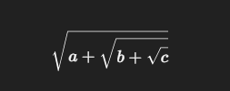

# Square Root Algorithm Description (FSM-based Implementation)
# 

 This project demonstrates the use of a Finite State Machine (FSM)
 to compute the integer part of the square root of a 16-bit number.

 While this task could alternatively be solved using:
   - a ROM-based lookup table (LUT), or
   - a hardware CORDIC block,
 here we use a bitwise algorithm controlled by an FSM.

 The input is a 16-bit unsigned integer 'x'.
 The goal is to compute the integer part of its square root:
     res = floor(sqrt(x));

## Key observation:
 If x is a 16-bit number, then sqrt(x) is guaranteed to be ≤ 255:
     255^2 = 65025 < 65536
     256^2 = 65536 → exceeds 16-bit range

 Therefore, the result will always fit in 8 bits.

 Instead of brute-force checking all values from 0 to 255,
 the algorithm checks each bit of the result, starting from the MSB:
     bit = 1 << 7 = 128
# 

## Let's walk through an example using the number 27

### Initial register values:
     x_reg         = 27
     result        = 0
     current_bit   = 128 (1 << 7)     state = CALC (next clock cycle)

### After the first clock cycle:
###     Register    Value
     
     result         0
     current_bit    128
     x_reg          27
     state          CALC

### The FSM is now ready to begin computation.

# 
## Clock Cycle 2: FSM in CALC state

#### FSM starts computing for the first time.

#### Current values:
     result        = 0
     current_bit   = 128
     x_reg         = 27

### What FSM does in CALC state:

     temp = result | current_bit;
     if ((temp * temp) <= x_reg) 
         res <= temp;
     current_bit <= current_bit >> 1;

### Step-by-step:
 1. Calculate temp:
     temp = res | bit = 0 | 128 = 128

 2. Check condition:
     temp * temp = 128 * 128 = 16384
     Compare with x_reg = 27:
     16384 > 27 →  too large

 3. Action:
     result stays 0 (128 is too big)
     current_bit is shifted right:
     current_bit = 128 >> 1 = 64

  Register values after cycle 2:
     result        = 0
     current_bit   = 64
     x_reg         = 27
     state         = CALC

# 
## Clock Cycle 3: FSM in CALC state

### FSM tests the next bit: bit = 64

### Current input values:
     result        = 0
     current_bit   = 64
     x_reg         = 27

### FSM step execution:

     temp = result | current_bit -> 0 | 64 = 64
     temp * temp = 64 * 64 = 4096
     Compare with x_reg = 27:
     4096 > 27 →  too large

### Updates:
     result stays 0
     current_bit is shifted right:
     current_bit = 64 >> 1 = 32

### Register values after cycle 3:
     result        = 0
     current_bit   = 32
     x_reg         = 27
     state         = CALC

# 
## Clock Cycle 4: FSM in CALC state

### FSM tests the next bit: bit = 32

### Current input values:
     result        = 0
     current_bit   = 32
     x_reg         = 27

### FSM step execution:

     temp = result | current_bit -> 0 | 32 = 32
     temp * temp = 32 * 32 = 1024
     Compare with x_reg = 27:
     1024 > 27 →  too large

### Updates:
     res remains 0
     bit is shifted right:
     bit = 32 >> 1 = 16

### Register values after cycle 4:
     result        = 0
     current_bit   = 16
     x_reg         = 27
     state         = CALC

#
## Clock Cycle 5: FSM in CALC state

### FSM tests the next bit: bit = 16

### Current state:
     result        = 0
     current_bit   = 16
     x_reg         = 27

### FSM step execution:

     temp = result | current_bit -> 0 | 16 = 16
     temp * temp = 16 * 16 = 256
     Compare with x_reg = 27:
     256 > 27 → too large

### Updates:
     result stays 0
     current_bit is shifted right:
     current_bit = 16 >> 1 = 8

### Register values after cycle 5:
     result      = 0
     current_bit = 8
     x_reg       = 27
     state       = CALC

# 
## Clock Cycle 6: FSM in CALC state

### FSM tests the next bit: bit = 8

### Current state:
     result        = 0
     current_bit   = 8
     x_reg         = 27

### FSM step execution:

     temp = result | current_bit -> 0 | 8 = 8
     temp * temp = 8 * 8 = 64
     Compare with x_reg = 27:
     64 > 27 → too large

### Updates:
     result remains 0
     current_bit is shifted right:
     current_bit = 8 >> 1 = 4

### Register values after cycle 6:
     result        = 0
     current_bit   = 4
     x_reg         = 27
     state         = CALC

# 
## Clock Cycle 7: FSM in CALC state

### FSM tests the next bit: bit = 4

### Current state:
     result        = 0
     current_bit   = 4
     x_reg         = 27

### FSM step execution:

     temp = result | current_bit -> 0 | 4 = 4
     temp * temp = 4 * 4 = 16
     Compare with x_reg = 27:
     16 ≤ 27 →  fits!

### Updates:
     result = temp = 4 → starting to build the result!
     current_bit is shifted right:
     current_bit = 4 >> 1 = 2

### Register values after cycle 7:
     result        = 4
     current_bit   = 2
     x_reg         = 27
     state         = CALC

# 
## Clock Cycle 8: FSM in CALC state

### FSM tries to include the next bit: bit = 2

### Current state:
     result        = 4
     current_bit   = 2
     x_reg         = 27

### FSM step execution:

     temp = result | current_bit -> 4 | 2 = 6 
     00000100 | 00000010 -> 00000110 (6)
     temp * temp = 6 * 6 = 36
     Compare with x_reg = 27:
     36 > 27 →  too large

### Updates:
     result remains 4
     current_bit is shifted right:
     current_bit = 2 >> 1 = 1

### Register values after cycle 8:
     result        = 4
     current_bit   = 1
     x_reg         = 27
     state         = CALC

# 
## Clock Cycle 9: FSM in CALC state

### FSM checks the least significant bit: bit = 1

### Current state:
     result        = 4
     current_bit   = 1
     x_reg         = 27

### FSM step execution:

     temp = result | bit -> 4 | 1 = 5
     temp * temp = 5 * 5 = 25
     Compare with x_reg = 27:
     25 ≤ 27 →  fits!

### Updates:
     result = temp = 5
     current_bit   = 1 >> 1 = 0 → computation is done

###  Register values after cycle 9:
     result        = 5
     current_bit   = 0
     x_reg         = 27
     state         = GOTO DONE (next cycle)

### Final result built bit-by-bit from MSB to LSB:
     √27 ≈ 5.19 → floor(√27) = 5 

# 
# Summary: Bitwise Square Root via FSM

 We scan bits from most significant to least significant (top-down).
    At each step, we ensure that the result is the largest possible value
    that does not exceed the true square root.

    This approach is similar to "bitwise approximation" —
    like a binary search, but done bit by bit.

# Latency:
     - 1 clock for START
     - 8 clocks for checking all bits (from 1<<7 to 1)
     - 1 clock for DONE

 Total: 9–10 cycles depending on FSM design

# Nested radicals

