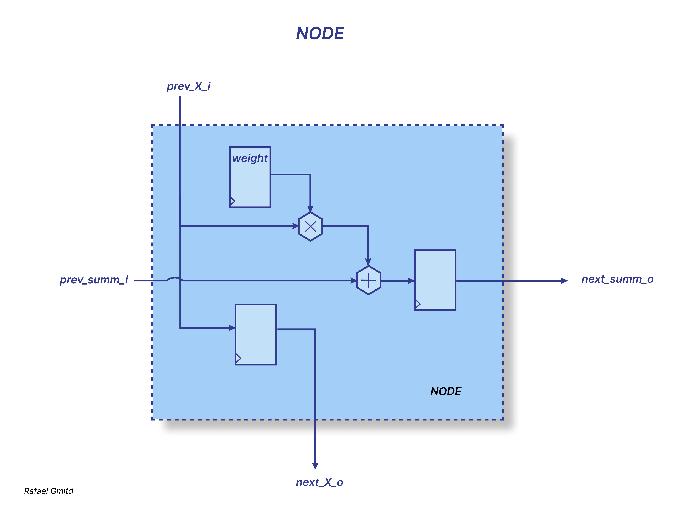

# *MATRIX*

Matrix, a set of numbers arranged in rows and columns so as to form a rectangular array. The numbers are called the elements, or entries, of the matrix.
If there are `i rows` and `j columns`, the matrix is said to be an `“i by j” matrix, written “i× j.”` For example:

```verilog
⎡ 1   3   5 ⎤ 
⎢ 2   7   8 ⎥ 
⎢ 6   1   9 ⎥ 
⎣           ⎦ 
```

is a 3 × 3 matrix. A matrix with i rows and i columns is called `a square matrix of order i`. An ordinary number can be regarded as a 1 × 1 matrix; 
thus, 3 can be thought of as the matrix [ 3 ]. A matrix with only one row and n columns is called `a row vector`, and a matrix with only one column and i rows 
is called `a column vector`.

Matrices occur naturally in systems of simultaneous equations. In the following system for the unknowns x and y,

```
4 x  + 5 y = -2
-2 x - 6 y = 3 
```

the array of numbers

```verilog
⎡  4    5 ⎤ 
⎢ -2   -6 ⎥ 
⎣         ⎦ 
```

The multiplication of a matrix A by a matrix B to yield a matrix C is defined 
`only when the number of columns of the first matrix A equals the number of rows of the second matrix B.`

To determine the element C(ij), which is in the `i` th row and `j` th column of the product, the first element in the `i` th row of A is multiplied by the first element in the `j` th column of B, the second element in the row by the second element in the column, and so on until the last element in the row is multiplied by the last element of the column; 
the sum of all these products gives the element C(ij).
`The matrix C has as many rows as A and as many columns as B.`

## Verilog

In Verilog declaring a matrix typically refers to defining a two-dimensional or multidimensional array, where each element may be a vector (packed) or an individual scalar (unpacked). This is commonly used to represent data structures like image buffers, lookup tables, or multi-channel data streams.

```verilog
reg [7:0] A1 [0:2][0:2];
```

3x3 matrix of 7-bit unsign registers

```verilog
A1 
[i] [j] 🡢
 🡣

⎡ A1[0][0]  A1[0][1]   A1[0][2] ⎤ 
⎢ A1[1][0]  A1[1][1]   A1[1][2] ⎥ 
⎢ A1[2][0]  A1[2][1]   A1[2][2] ⎥
⎣                               ⎦ 
```
### 1D 🡢 2D

In Verilog (or more precisely, SystemVerilog), you can declare a flat vector and then reinterpret or map it into a 3×3 matrix using unpacked arrays. This is useful when you receive a serialized input (e.g., a 1D bus) and want to work with it as a 2D structure.

```verilog
// Declare a flat 72-bit input vector (9 elements × 8 bits each)
logic [71:0] flat_data;

// Declare a 3×3 matrix of 8-bit elements
logic [7:0] matrix [0:2][0:2];

.....

always_comb begin
    // Row 0
    matrix[0][0] = flat_data[71:64];
    matrix[0][1] = flat_data[63:56];
    matrix[0][2] = flat_data[55:48];

    // Row 1
    matrix[1][0] = flat_data[47:40];
    matrix[1][1] = flat_data[39:32];
    matrix[1][2] = flat_data[31:24];

    // Row 2
    matrix[2][0] = flat_data[23:16];
    matrix[2][1] = flat_data[15:8];
    matrix[2][2] = flat_data[7:0];
end
```
Or using concatenation

```verilog
logic [71:0] flat_data;
logic [7:0] matrix [0:2][0:2];

.....

always_comb begin
    { matrix[0][0], matrix[0][1], matrix[0][2],
      matrix[1][0], matrix[1][1], matrix[1][2],
      matrix[2][0], matrix[2][1], matrix[2][2] } = flat_data;
end
// Note that elements in the concatenation list go from most significant bits to least significant (left to right).
// flat_data[71:64] ends up in matrix[0][0]
```
Same thing using a for loop

```verilog
logic [71:0] flat_data;
logic [7:0] matrix [0:2][0:2];

.....

always_comb begin
    for (int i = 0; i < 3; i++) begin
        for (int j = 0; j < 3; j++) begin
            matrix[i][j] = flat_data[71 - ((i * 3 + j) * 8) -: 8];
        end
    end
end
// -: 8 is SystemVerilog syntax for a part-select: flat_data[start -: width] means "take width bits starting from start, going down".
// i * 3 + j gives the linear index from 0 to 8.
// first row  i = 0 0 0 j = 0 1 2
// second row i = 1 1 1 j = 0 1 2 
// therd row  i = 2 2 2 j = 0 1 2 
```

### 2D 🡢 1D

Reverse: matrix → vector (via concatenation)

```verilog
always_comb begin
    flat_data = { matrix[0][0], matrix[0][1], matrix[0][2],
                  matrix[1][0], matrix[1][1], matrix[1][2],
                  matrix[2][0], matrix[2][1], matrix[2][2] };
end
```

Reverse: using for loop

```verilog
always_comb begin
    for (int i = 0; i < 3; i++) begin
        for (int j = 0; j < 3; j++) begin
            flat_data[71 - ((i * 3 + j) * 8) -: 8] = matrix[i][j];
        end
    end
end
```
### Multiplication

The main rule for matrix multiplication is:
The number of columns in the first matrix must equal the number of rows in the second matrix.

If you have matrices:
A of size `𝑚×𝑛` and B of size `𝑛×𝑝`
Then the product  𝐶 = 𝐴 × 𝐵 is defined, and the resulting matrix C will have size `𝑚×𝑝`.

A                                   B                                   C

⎡ A[0][0]  A[0][1]   A[0][2] ⎤       ⎡ B[0][0]  B[0][1]   B[0][2] ⎤       ⎡ C[0][0]  C[0][1]   C[0][2] ⎤
⎢ A[1][0]  A[1][1]   A[1][2] ⎥   X   ⎢ B[1][0]  B[1][1]   B[1][2] ⎥   =   ⎢ C[1][0]  C[1][1]   C[1][2] ⎥
⎢ A[2][0]  A[2][1]   A[2][2] ⎥       ⎢ B[2][0]  B[2][1]   B[2][2] ⎥       ⎢ C[2][0]  C[2][1]   C[2][2] ⎥
⎣                            ⎦       ⎣                            ⎦       ⎣                            ⎦

Matrix multiplication can be viewed as performing linear equations or linear transformations.

C[i][j] = A[i][0] * B[0][j] + A[i][1] * B[1][j] + A[i][2] * B[2][j] ... + ... A[i][n-1] * B[n-1][j]

# *Systolic Array*

### What Is a Systolic Array?

In parallel computing, a systolic array is a structured grid made up of identical processing elements, often referred to as cells or nodes. 
Each cell operates independently: it receives data from its upstream neighbors, performs a local computation—such as a partial multiplication or addition—stores the intermediate result, and passes it on to the next node in the chain.

This design enables a high degree of parallelism. Data flows continuously through the array, and computations are carried out step-by-step as the information moves from one cell to the next. The architecture gets its name from the rhythmic, pulse-like movement of data through the array—similar to the systole in the human heart, where blood is pumped in regular pulses through the circulatory system.



