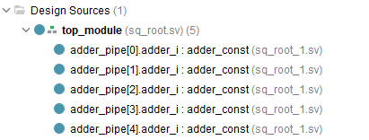
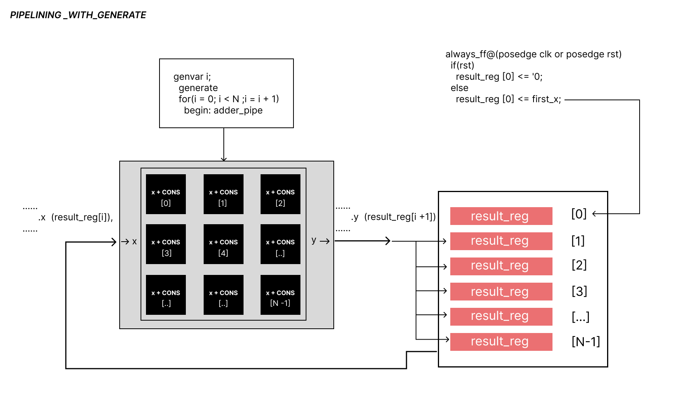

## Generate constructs

Sometimes in a project, you need to repeat the same block many times — for example, a module that performs the same operation on different data (like in a pipeline or an array). Or, on the contrary, you may want to include a certain piece of logic only if a specific parameter is enabled.

The generate construct unrolls all the generated code before simulation — during the stage called elaboration (the design elaboration phase that happens before compilation and simulation). It expands everything that was wrapped inside a generate loop.

A register array is created, and the initial input value is stored in the first element, result_reg[0]. Then, the result of the first module’s computation is stored in the second element, result_reg[1]. In the next stage, the module receives result_reg[1] as input — which is the result of the previous stage — and stores its output in result_reg[2]. In this way, each successive module takes the result from the previous one and continues the computation, forming a processing chain.