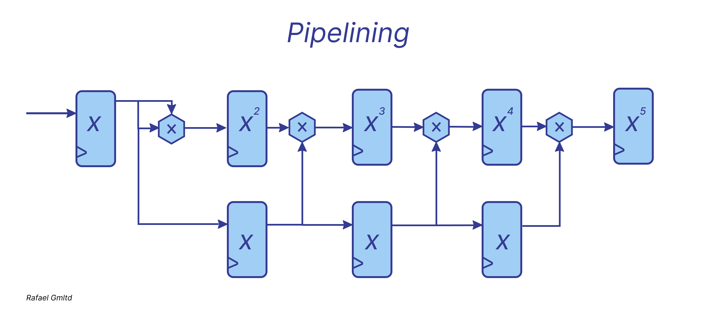
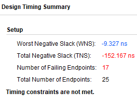
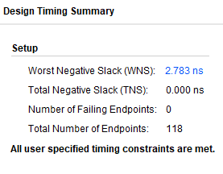
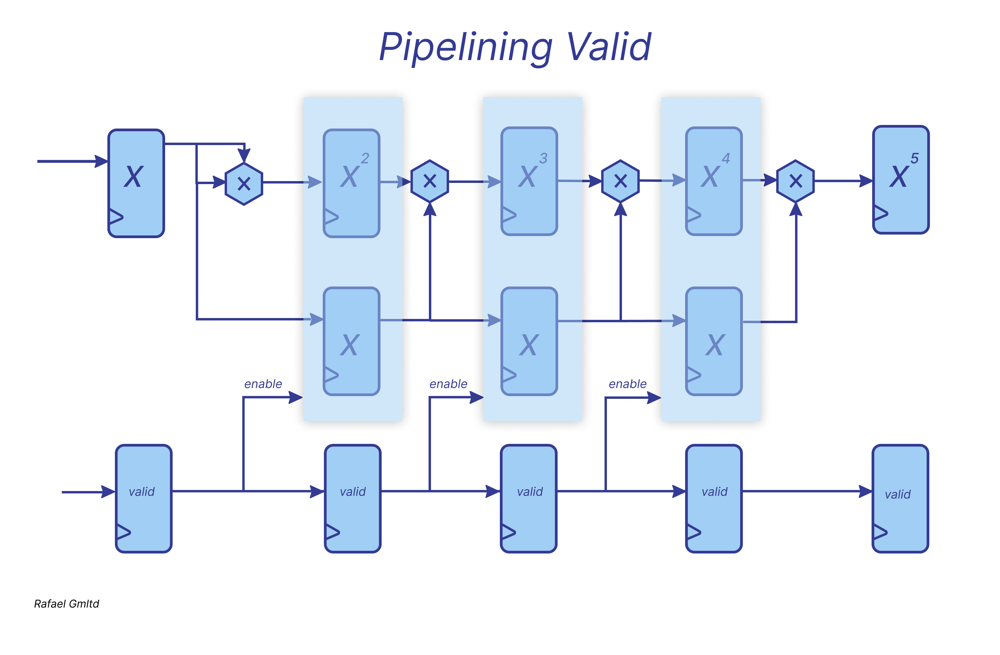

# *Pipelining*

## The critical path

The critical path is the longest segment of combinational logic, and it determines the clock frequency.
What to do if the critical path is too long?
The simplest approach is to break it up by inserting registers within segments of combinational logic. This is the fundamental principle of pipelining.
Pipelining is the process of dividing a computational task into separate stages, each executed in a single clock cycle. Once a stage is completed, the data is passed to the next stage, allowing the first stage to begin processing a new set of data.
As a result, the maximum delay is reduced, allowing for a higher clock frequency.
However, latency increases—meaning the output result takes multiple clock cycles to appear.

## Pipeline Filling

Initially, as data enters the pipeline, the first output corresponds to the first input, similar to how water flows through a pipe.

## Key Feature of Pipelining

A crucial characteristic of pipelining is that it carries input values along with it for a certain number of clock cycles.

Example: Automotive Assembly Line

Without pipelining: Constantly returning to fetch the initial input values, which slows down the process.
With pipelining: The input values travel through the pipeline for three clock cycles, eliminating the need to hold them at the initial trigger.

Instead of keeping the input occupied, a new value X can be fed in every clock cycle, allowing continuous computation without delays.
In a pipelined architecture, new data can be fed into the input every clock cycle without waiting for the computations of the previous value to complete.

## Pipeline Concept for Exponentiation

Concept of Pipelining
In pipelining, a task is divided into smaller stages, each performing part of the computation. The result from each stage is passed on to the next stage, and multiple tasks can be processed simultaneously at different stages of the pipeline. Here's how it works for exponentiation:

Stage 1: Compute 
𝑆1 = 𝑋 × 𝑋

Stage 2: Compute 
𝑆2 = 𝑆1 × 𝑋

Stage 3: Output the result 
𝑌 = 𝑆2

Each of these stages is executed in parallel during different clock cycles, allowing a new input value to be processed each cycle.

## Example Scenario: Calculating Cube of Multiple Numbers

For instance, let's assume you need to compute the cube of three numbers:

- \( X1 = 2 \)
- \( X2 = 3 \)
- \( X3 = 4 \)

Here’s how the pipeline would work over several clock cycles:

| Clock Cycle | Stage 1 (X²)  | Stage 2 (X³) | Output (Y) |
|-------------|---------------|--------------|------------|
| **1**       | \( X1² = 4 \)  | -            | -          |
| **2**       | \( X2² = 9 \)  | \( X1³ = 8 \) | -          |
| **3**       | \( X3² = 16 \) | \( X2³ = 27 \) | \( Y1 = 8 \) |
| **4**       | -               | \( X3³ = 64 \) | \( Y2 = 27 \) |
| **5**       | -               | -            | \( Y3 = 64 \) |

Each clock cycle processes a new number, while intermediate results are propagated through the pipeline.
Otherwise, we would have to wait for three cycles before supplying new data to the input.

## WNS (Worst Negative Slack)

Slack is the difference between the required arrival time (required time) and the actual arrival time (arrival time).

WNS is the worst (most negative) slack in the design.

Positive WNS → The design can operate at a frequency higher than the specified one.

WNS = 0 → The design can operate exactly at the required frequency, but without any margin.

Negative WNS → The design cannot operate at the required clock frequency because signals do not stabilize in time.

For the sake of experiment, I will run a code that raises a number to the 5th power without pipelining. This means performing 5 multiplications, resulting in a fairly long critical path, which will negatively affect the clock frequency of our design. We can check the Vivado timing report and confirm that the WNS will be negative.

Now let's run the same code, but with pipelining.

## Clock Gating

A mechanism for disabling the clock signal to logic fragments when they are not needed.

This significantly reduces power consumption since inactive components do not expend energy processing clock pulses.

Let's take our exponentiation pipeline as an example. If invalid data is received at the input, which does not require exponentiation, then this logic block can be disabled.

One might ask: why not use asynchronous flip-flops to reset the data instead? The issue is that this would require routing a reset signal to the D flip-flop input, which immediately clears the flip-flop. However, the presence of such a reset increases the area of a single register by 25–35%.

For this reason, standard cell libraries include two types of registers: DFFR (D flip-flop with reset) and DFF (D flip-flop without reset).

As a result, designers often aim to eliminate the use of larger registers whenever possible.

We add a flag indicating that the data in the current clock cycle is valid, correct, and can be latched and processed in the pipeline.

If there is no ready data, the valid signal is set to zero for the required number of cycles, signaling that there is no valid data at the register input.

Logically, if there is no valid data, there is no reason to propagate it through the pipeline. The valid output of the register is used to control groups of registers responsible for storing data for the next stage.

Thus, starting from a certain pipeline stage, enable can be kept high if the data is valid and should be processed further.

The valid logic is free-running—it does not have a separate enable. However, the registers storing the data now depend on enable, allowing resource savings by disabling unnecessary computations.

