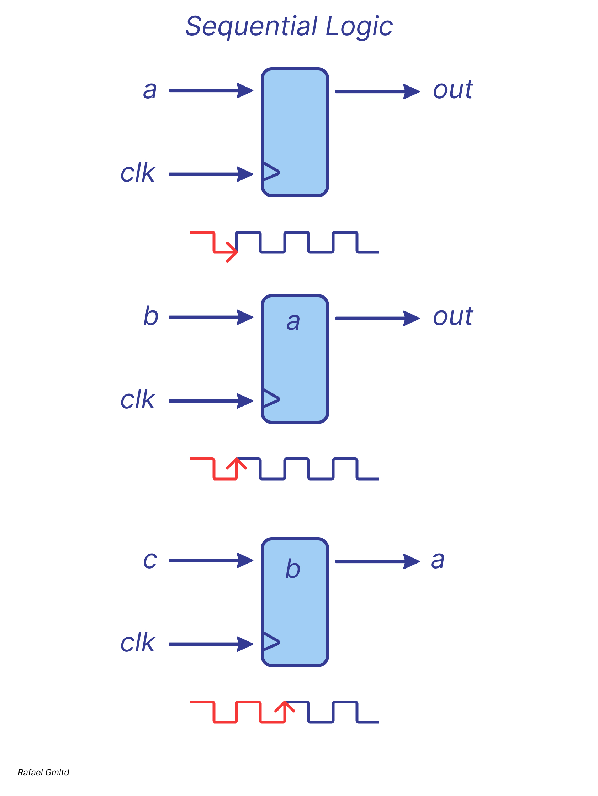

# *Sequential Logic*

A sequential logic circuit is a circuit that incorporates memory, which gives it an internal state. Unlike combinational logic, 
where the output is determined solely by the current inputs, the output of a sequential circuit depends both on the input signals and its current state.
The most widely used approach for designing such circuits is the synchronous methodology. In this approach, 
all memory elements operate under the control of a common clock signal, and data is captured and stored on its rising (or falling) edge,
ensuring coordinated operation of the entire circuit.

