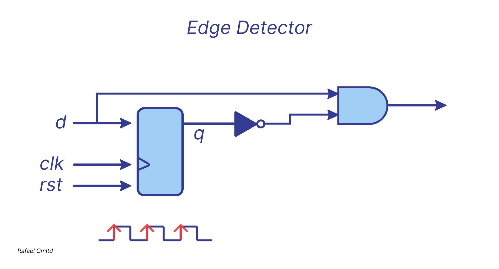

# *Posedge detector*

The rising-edge detector is a circuit that generates a short one-clock-cycle tick when the
input signal changes from 0 to 1. It is usually used to indicate the onset of a slow timevarying
input signal.

# *One cycle pulse detector*

This module is designed to detect a specific sequence of values in signal d. 
It searches for the particular pattern: 0 → 1 → 0. In this context, 
it means the module looks for a single pulse in signal d that lasts exactly one clock cycle, 
transitioning from a low state (0) to a high state (1), and then back to a low state (0).

How sequence detection works:
The module shifts the values of signal d in a shift register on each clock pulse.

The shift register stores the last three values of signal d.

When the register reaches the state 010, which corresponds to the pattern 0 → 1 → 0 over three consecutive clock cycles,
it generates a signal detected = 1.

So, as soon as '010' is detected, the 'detected' signal becomes 1, but only for one clock cycle. 
After that, 'detected' becomes 0 again, making it a one-clock pulse.

| clk   | d |  q[2]  |  q[1]  |  q[0]  | detected |
|-------|---|--------|--------|--------|----------|
|   0   | 0 |   0    |   0    |   0    |    0     |
|   1   | 1 |   0    |   0    |   1    |    0     |
|   2   | 0 |   0    |   1    |   0    |    1 ✅  |
|   3   | 1 |   1    |   0    |   1    |    0     |
|   4   | 1 |   0    |   1    |   1    |    0     |
|   5   | 0 |   1    |   1    |   0    |    0     |
|   6   | 0 |   1    |   0    |   0    |    0     |

