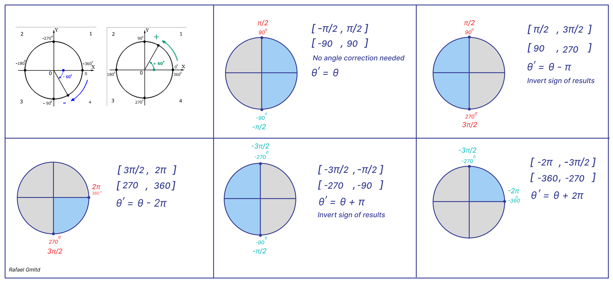

# *UART CORDIC*

Let me start by clarifying that I am not the original author of this project and I do not claim credit for someone else’s work.
All the core development was done by Grant Yu.
Here is the link to his GitHub: https://github.com/grant4001
Original project repository:    https://github.com/grant4001/CORDIC-UART-Artix-7
YouTube video walkthrough:      https://www.youtube.com/watch?v=Tul1gOaTunQ

I only made minor modifications — I added an external tick generator module and replaced the FIFO with a more general-purpose one.
Most importantly, I studied and analyzed his project thoroughly, as my primary goal is learning and gaining a deeper understanding.

The goal of this project is to implement, in FPGA hardware, a CORDIC computation block that converts a user-specified angle into its sine and cosine values.

## Python Client Script

On the PC side, a Python script is used to send data to the FPGA over UART. The script performs the following tasks:
Opens the serial port with a specified baud rate  and odd parity;
Takes an angle input from the user in degrees, converts it to radians, and then to a fixed-point format Q4.44 using the FixedPoint library;
Builds a data packet that includes a header, command byte, and the encoded angle value;
Calculates an 8-bit CRC over the entire packet using a polynomial 0x9B (via LFSR method);
Sends the packet to the FPGA over UART;
Receives a response, which contains cos(θ) and sin(θ) values in Q2.46 fixed-point format, and performs CRC-8 verification.
The script supports two operation modes:

1. Single-angle transmission — sends one angle at a time;
2. Burst transmission — allows sending up to 8 angles in one packet.

## FPGA Data Handling
Once the packet is received by the FPGA, it goes through the following processing stages:

### uart_rx module:

Receives the packet byte by byte;

Performs basic framing and integrity checks (e.g., stop bit, parity);

Passes the complete packet to the next stage if no UART-level errors are detected.

### rx_msg module:

Parses the packet;

Extracts the command byte and angle data;

Forwards the command byte directly to the tx_msg module;

Sends the angle (in fixed-point Q4.44) to the cordic_sincos computational module.

### cordic_sincos module:

Computes cos(θ) and sin(θ) using a fully pipelined CORDIC algorithm;
Outputs the results in fixed-point Q2.46 format.

### tx_msg module:

Receives the command byte and computed values;
Assembles a new response packet including header, command, cos(θ), sin(θ), and recalculated CRC-8;
Pushes the completed packet to an output FIFO to decouple computation from transmission.

### uart_tx module:

Reads the response packet from the FIFO;
Sends it byte-by-byte back over UART to the Python client.

### Client-side (Python):

Validates the returned packet with CRC-8;
Converts the fixed-point values back to floating-point;
Displays the results to the user.

# Parity Bit Generation on Transmission:

Before sending a byte:

Take 8 bits of data (for example, data = 8'b10110010)
Count the number of ones: num_ones = 4
Based on the parameter PARITY_EO:

If PARITY_EO = 0 (even parity):
parity_bit = ^data (XOR of all bits)
→ This bit will be 0 when the total number of ones is even.

If PARITY_EO = 1 (odd parity):
parity_bit = ~(^data) (inverted XOR)
→ This ensures that the total number of ones becomes odd.

The generated parity_bit is inserted after the 8 data bits, just before the stop bit.

# Parity Check :

After receiving 8 data bits, one parity bit is read (only if PARITY_ON = 1).
Count the number of ones in the 8 data bits → num_ones

Perform the check based on PARITY_EO:

If PARITY_EO = 0 (even parity):
(num_ones + parity_bit) % 2 == 0

If PARITY_EO = 1 (odd parity):
(num_ones + parity_bit) % 2 == 1

If the condition fails, a parity error is detected and the packet is considered corrupted.

# What is CRC-8 and Why It's Used:

CRC (Cyclic Redundancy Check) is a method for verifying data integrity. In this project, CRC-8 with generator polynomial 0x9B (binary 10011011) is used.

### How CRC-8 Works on Transmission:

Before sending a packet (header, command, data), CRC-8 is calculated over all bytes.
The resulting 1-byte CRC is appended to the end of the packet.
The full packet is then sent over UART.

### How CRC-8 Works on Reception:

On the receiver side (in uart_rx or rx_msg), CRC-8 is recomputed over the entire received packet, including the CRC byte.
If the final CRC result is 0, the packet is valid.
If the result is non-zero, a transmission error is detected — the packet is considered corrupted.

# Fixed-Point (Fractional)

A fixed-point number has:

1. An integer part (before the decimal point)
2. A fractional part (after the decimal point)

It can be either signed or unsigned.

### Unsigned Fixed-Point Number

Represents only positive values (including zero)
All bits are used for magnitude
Example: Q4.4 unsigned

4 bits for integer part → range: 0 to 15

4 bits for fractional part → resolution: 1/16

### Signed Fixed-Point Number

Represents both negative and positive values
The most significant bit (MSB) is the sign bit (0 = positive, 1 = negative)
Typically uses two’s complement representation
Example: Q4.4 signed

4 bits for integer part → range: -8 to +7

4 bits for fractional part → resolution: 1/16

# "Two's Complement"

Two's complement is a method for representing negative numbers in binary.
Positive numbers are represented as usual in binary.

To represent a negative number:
Invert all bits of the positive version (NOT operation).
Add 1 to the result.

Example:

Let’s say we want to represent –3 using 4 bits.

- Binary of +3 = 0011
- Invert bits: 1100
- Add 1: 1100 + 1 = 1101

So, –3 = 1101 in 4-bit two’s complement.

### Example: Number 2.5 in unsigned Q4.44 format

1. Unsigned Q4.44 format:  
- 4 bits for the integer part (no sign)  
- 44 bits for the fractional part  
- Total 48 bits.

2. Convert the number to fixed-point:  
Multiply the number by \(2^{44}\):

\[
2.5 \times 2^{44} = 2.5 \times 17,592,186,044,416 = 43,980,465,111,040
\]

3. Convert to binary:  
Represent the integer \(43,980,465,111,040\) as a 48-bit binary number or hex (280000000000)
You can use the script located in the Python folder named `angle_conversions.py` to verify the result — it will output 2.5.

4. Result:  
This 48-bit unsigned integer is the fixed-point representation of 2.5 in Q4.44.

To convert back to a floating-point number:

\[
\frac{43,980,465,111,040}{2^{44}} = 2.5
\]

So, for unsigned fixed-point numbers, you just multiply the floating number by \(2^{\text{fractional bits}}\) 
and convert to an integer — this integer is the fixed-point encoding.

# CORDIC algorithm 

## Input Angle Preprocessing in CORDIC (`cordic_sincos_preprocess` Module)

- The input angle is given in fixed-point format **Q4.44**, with a full range from **-2π** to **+2π**.
- The normalization process maps the angle to the range **[-π/2, +π/2]**, since the main CORDIC rotation range is ±π/2.

Normalization rules:

- If the angle is within **[-π/2, π/2]**   , no change is applied.
- If the angle is in     **(π/2, 3π/2]**   , subtract π and invert the sign of the results (sin and cos).
- If the angle is in     **(3π/2, 2π]**    , subtract 2π.
- If the angle is in     **[-3π/2, -π/2)** , add π and invert the sign of the results.
- If the angle is in     **[-2π, -3π/2)**  , add 2π.

These operations are implemented via logical checks and arithmetic on the Q4.44 angle value.

After normalization, the angle is shifted left by 2 bits (converted from **Q4.44** to **Q2.46**) to scale it to the format of the coefficient and arctangent lookup tables used in the main CORDIC stages.

