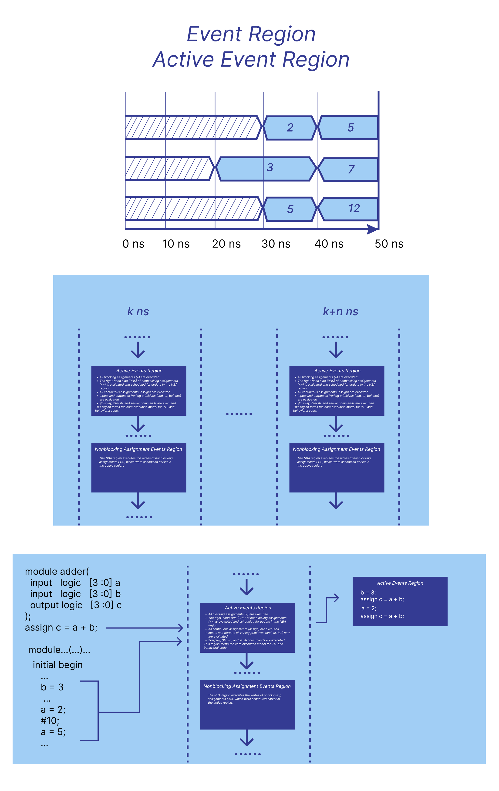

# *Introduction to Functional Verification*

The goal of hardware design is to create a device that performs a specific task according to a design specification.
The goal of verification, in turn, is to ensure that the design actually performs the intended function correctly — in other words, that the implemented circuit is a faithful representation of the specification.

Functional verification involves simulating the behavior of the device over time, monitoring signal transitions, and comparing the output values to the expected results.

To accomplish this, a test environment is used, typically composed of three key components:

Reference model — a golden model that defines the expected behavior of the device, based on the specification. It provides the “what should happen” baseline.

Design Under Test (DUT) — the actual module implemented in RTL (e.g., in Verilog or VHDL) that is being verified.

Testbench — defines the input stimuli applied to the DUT and the logic used to check its outputs against the expected results.

## Testbench

### The initial Procedural Block

The initial block in Verilog is used to define initial behavior, and each initial block executes once at the beginning of simulation time.
You can declare multiple initial blocks in a single module, and all of them will execute concurrently during simulation startup.

Typical uses of initial blocks in testbenches include:

- signal initialization;

- defining timed stimulus;

- simulating reset, enable, and other control sequences;

- printing debug output using $display.

Inside a single initial block, all statements are executed sequentially from top to bottom, in the exact order they are written. 
This means if you assign a value, then delay, then assign again — the simulator will follow that exact sequence, respecting any delays.

### The timescale Directive

The Verilog **timescale`** directive defines the time unit and time precision for simulation.

`timescale <time_unit> / <time_precision>

This means:
1ns — one simulation time unit equals 1 nanosecond.
1ps — time precision is 1 picosecond (smallest time resolution).

It affects:
Delay statements like #10 (interpreted as 10 nanoseconds here)

The delays used in a testbench (with the # operator) do not represent real physical delays in the hardware components. 
They are not meant to simulate gate delays, wire delays, or actual timing behavior of the physical device.

SystemVerilog describes processes over time. Each initial, always, and assign is a process that occurs over time, and during simulation,
these processes are executed concurrently. Processes create events and react to them — for example, when a variable changes.
So, in simulation, we change the value of a variable inside an initial block, and this change will trigger a reaction in another process — for example, 
in an assign block that we are testing.
In other words, changes within a process can affect the process itself, causing the value to be recalculated.
The simulator progresses through time steps, and for each time moment there is a specific set of events.
It’s not possible for a signal to be both 0 and 1 at the same time.

The transition to the next moment in time happens only after all events in the current time point have been processed.

This means the simulation executes all required assignments for the current time, and only then moves on. 
That’s where time delays (#) come in — they act like a command that says: "do the assignments, wait, then move on to the next step." 
They establish a certain order and sequencing.

### Event Regions

After the simulator computes assignment values, it sends them to so-called event regions. There are several of them, and each performs its own specific task.
We will focus on the two most important ones: the Active Events Region and the Nonblocking Assignment Events Region (NBA region), 
where the actual assignments and processes take place.
For each moment of simulation time, these event regions exist and execute in a defined order.

1. Active Events Region

What happens in this region:
All blocking assignments (=) are executed

The right-hand side (RHS) of nonblocking assignments (<=) is evaluated and scheduled for update in the NBA region

All continuous assignments (assign) are executed

Inputs and outputs of Verilog primitives (and, or, buf, not) are evaluated

$display, $finish, and similar commands are executed

This region forms the core execution model for RTL and behavioral code.

*Example*

A nonblocking assignment is taking place.
Everything described happens within a single initial block.
The assignments occur sequentially, one after another.

The simulator executes the assignments and sends them to the Active region — all of this happens at the same simulation time.

At that very same simulation moment, an assign statement is also triggered.
But!
These are two different processes:

One is performing the assignments (e.g., a = 2; then b = 3;)

The other is computing a result (e.g., assign c = a + b;)

Here's the important part:
Inside each process (e.g., within an initial or always block), the statements are executed strictly in order.
However, within the Active region as a whole, the simulator is free to reorder execution between different processes however it sees fit.

The simulator:

- Sees an assignment → realizes it will update variable a

- Since there's an assign c = a + b, it realizes this must be recomputed

- So the assign gets triggered — that is, it gets updated

- But it could also happen the other way around:

- The simulator might first schedule both assignments

- And then execute the assign

We do not know in which order this will happen — specifically within the Active region.
It depends on the simulator.

Important:
All of this occurs in delta time — i.e., during a zero physical time step.
We cannot observe this internal ordering, but at the end of this delta, the simulator will still output the final, updated assignment result.

Therefore, any verification or checking of the result must happen after a delay.
Otherwise, the check might be incorrect.
If we try to verify the value of c in the same time slot, the result may not match our expectations, and the test could falsely fail

2. Nonblocking Assignment Events Region (NBA region)

The NBA region executes the writes of nonblocking assignments (<=), which were scheduled earlier in the active region.

All computations are performed in the Active region,
but the latching (updating of left-hand sides) of nonblocking assignments happens only in the NBA (Nonblocking Assignment) region.

In other words:
First, everything in the Active region is executed — this includes:

RHS (right-hand side) evaluation of nonblocking assignments

Continuous assignments

Blocking assignments

Primitive evaluations

Only after that, the values scheduled for nonblocking assignments are actually assigned to their destinations in the NBA region.

Event waiting is implemented using the @ operator.
The event wait blocks the process until the value of the expression changes.
For example, @ (posedge clk) waits for the rising edge of the clock signal.

The main difference from verification of purely combinational logic is the presence of:

- Clock signal generation

- Synchronization to the clock

- Reset signal

- Nonblocking assignments (<=)

Here, first blocking assignments execute and all calculations happen in the Active Event Region,
and only after that are nonblocking assignments updated in the NBA (Nonblocking Assignment) Region.

That’s why checks should be performed in the next clock cycle,
because checking in the same cycle may lead to incorrect results — values are not latched yet.

