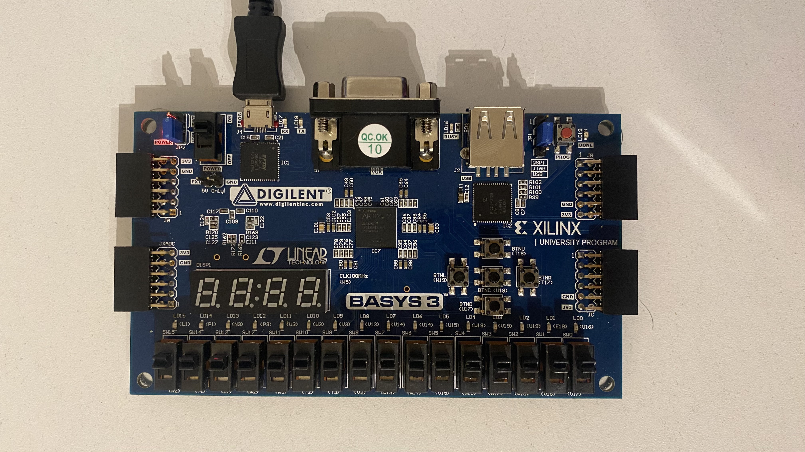

For performing all the laboratory work, I will be using the FPGA Development Board Basys 3 Artix-7 by Digilent.



All the specifications for this FPGA Development Board can be found through the link I will attach below.

[Basys 3](https://digilent.com/reference/programmable-logic/basys-3/reference-manual)


I will also attach a file with the  ```Basys-3-Master.xdc```  extension.The .xdc file in Vivado is used to specify constraints for the designed digital circuit.
1. Pin assignments: it specifies which signals will be connected to specific FPGA pins.
2. Clock constraints: defining clock frequencies for various signals.
3. .... and so on.

Note that all I/O names must match the names in the .xdc file

In the file  ```basys3_specific_top.sv```  the main specifications of the Development Board I will be working with for all subsequent lab works are described.