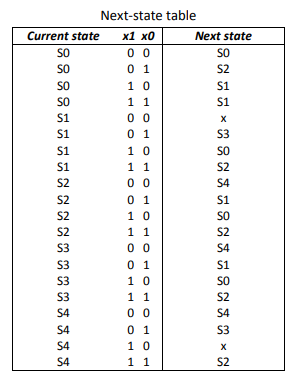

# Moore machine

It is a Moore machine because the outputs depend on the states but do not
depend on the transition (edge).
Inputs are associated to the state transitions, above the arcs which represent the transitions.
There are 2 inputs that we will name as x1 and x0.
There are 2 outputs that we will name as y1 and y0.
The state-transition or next-state-table tells us which will be the next state of the graph depending 
on the current state and the input:

