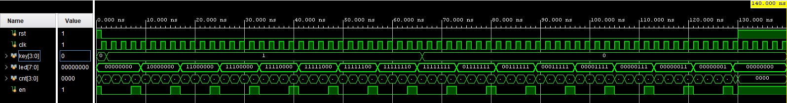

# *Shift Register*

###  How It Works

1. First, we reset the shift register to 0 using the rst signal.
2. Then, if at least one of the buttons is pressed, an input signal triggers and sets a logical 1 at the input.
3. This logical 1 is fed into the first register, but the actual writing occurs only on the posedge of the clock when the enable signal (en) is 1.
4. The enable condition is controlled by a 4-bit counter, which activates en when its two least significant bits (LSB) are 0. This happens every 4 clock cycles (2^2). This same approach was used in the binary counter implementation (see binary_counter).
5. Thus, when a button is pressed, a logical 1 is stored in the first register. Now, every 4 clock cycles, our logic shifts this 1 one bit to the right, until it reaches the least significant bit :

```$shift_reg = {button_on, shift_reg[LED-1:1]};```                                                                                                                          

6. The least significant bit of our shift register can be:
- Output to the system.
- Or, we can loop our shift register, where the output data is fed back to the input:

```shift_reg = {shift_reg[0], shift_reg[7:1]};```                                                                                                                  

7. We can modify the logic so that the data shifts to the left instead of the right:         

```shift_reg = {shift_reg[N-2:0], button_on};```                                                                                                          

We can also input entire sequences of data and shift them through the register to pass them further

During the simulation, we hold the button until our shift register is completely filled with 1s. Then, we release the button and observe how the shift register gradually shifts all the 1s.



###  Shift left shift register 

``` else if (enable & ~sw[1] & sw[2])```

```shift_reg <= {shift_reg[W-2:0], button_on}; ``` 


###  Shift right shift register 

``` else if (enable & sw[1] & sw[2])```

```shift_reg = {button_on,shift_reg[W-1:1]}; ``` 


###  Ring shift register 

``` else if (enable & ~sw[2])```

```shift_reg = {shift_reg[0],shift_reg[W-1:1]}; ``` 


