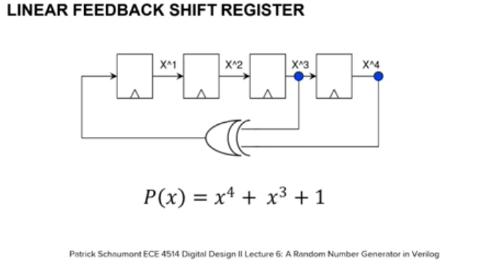

# *Linear Feedback Shift Register (LFSR)*

## How does an LFSR work?

1. Shift Register: A sequence of bits (e.g., an 4-bit shift register).
2. Feedback: Certain bits from the register are fed into an XOR gate.
3. Polynomial: Defines which bits participate in the feedback (called the characteristic polynomial). For example:

``` x^4+x^3+1 ```                                                                                                                                                    

means that bits 4 and 3 are used, and their XOR result is fed back into the least significant bit.
4. Shifting: After computing the new bit, the register shifts right (or left), and the new bit is inserted into the most (or least) significant bit.
5. Repetition: The sequence repeats after a certain period

## Example (4-bit LFSR)

Let's consider an LFSR with the polynomial

``` x^4+x^3+1 ```                                                                                                                                                    

and an initial state (seed) of

``` 1001 ```        

| Step | Register|XOR (3 ⊕ 4)| Output Bit |
|------|---------|------------|------------|
| 0    | 1001    | 1 ⊕ 0 = 1 | 1          |
| 1    | 1100    | 1 ⊕ 1 = 0 | 0          |
| 2    | 0110    | 0 ⊕ 1 = 1 | 1          |
| 3    | 1011    | 1 ⊕ 0 = 1 | 1          |
| 4    | 1101    | 1 ⊕ 1 = 0 | 0          |
| ...  | ...     | ...        | ...        |

This generator produces a pseudorandom sequence until it repeats.

